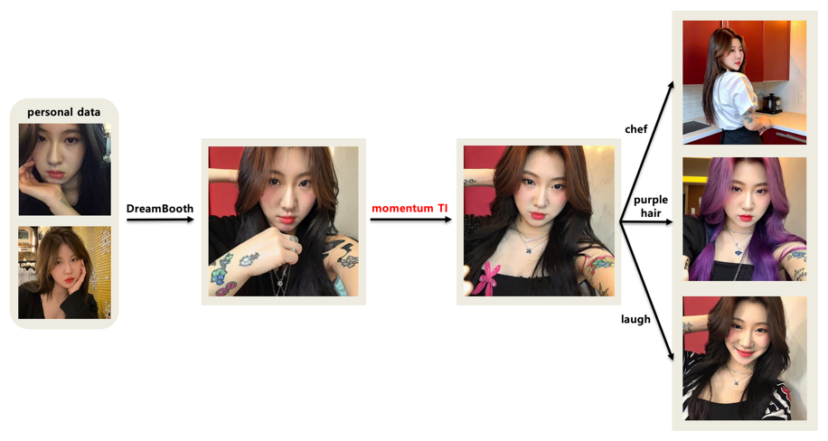

# Enhance personalizing stable diffusion for human via momentum textual inversion


## Summary

Fine-tune identifier embedding vector for human images based on Google's [Dreambooth](https://arxiv.org/abs/2208.12242) with [Stable Diffusion](https://github.com/CompVis/stable-diffusion)! 
**Momentum Textual Inversion** is the enhanced optimizing methodology-in terms of fidelity and similarity compared to original personal data-originated from [Textual Inversion](https://arxiv.org/abs/2208.01618) in human-image domain. 
In addition, I added some features including prompt engineering and facial loss to get high-fidelity generation. 
The follow overview is how I tackled enhancing fine-tuning embedding vector for human-images during internship on Generation Team at [NCSOFT Vision AI Lab](https://nc-ai.github.io/). This code repository is based on that of [Textual Inversion](https://github.com/rinongal/textual_inversion).   


## Environment
Our code builds on, and shares requirements with Latent Diffusion Models (LDM). To set up their environment, please run:
```
conda env create -f environment.yaml
conda activate ldm
```
or build docker image with my Dockerfile:
```dockerfile
docker build -t <username>/<imagename> .
docker run -d -it -P --name <image_name> <username>/<imagename>
```

## Train
```python
python main.py  
    --base configs/stable-diffusion/v1-finetune.yaml 
    -t --actual_resume ./models/ldm/dreambooth/yerinbaek_gs_3000.ckpt 
    -n yerinbaek 
    --gpus 0, 
    --data_root ./inputs/female_2/ 
    --gamma 0.1 
    --descriptive_p 0.1 
    --use_random_prompt 
    --class_word woman
```

## Sampling
```python
python scripts/stable_txt2img.py 
    --ddim_eta 0.0 
    --n_samples 8 
    --n_iter 2 
    --scale 7 
    --ddim_steps 100 
    --ckpt ./models/ldm/dreambooth/yerinbaek_gs_3000.ckpt
    --embedding_path ./<embedding_path>/embeddings_ep-2.pt 
    --prompt "photo of a * woman" 
    --outdir ./outputs/yerinbaek/ep2/random_facial
```

## Momentum Textual Inversion
**Background**  
I observed that using Textual Inversion optimization on Dreambooth model did not improve the similarity. 
Training embedding vector with TI converges but is farfrom original ID.

What I expected using TI on dreambooth is described at the left side picture below, while how TI exactly worked is described at right side picture below. It converges somewhere but not the global one.


**Principal**  
Hence I needed to apply new method based on momentum to optimize embedding vector. It helps embedding vector not jump far away from where it begins.  

Textual Inversion optimizes embedding vector itself, whereas momentum Textual Inversion optmizes training vector that updates with ratio from the previous embedding vector. Follow picture shows comparison between TI and momentum TI.  


**Results**  
As a result, there was certain enhancement on similarity and fidelity when using additional momentum TI optimization. 
Using random prompt template provided from [Textual Inversion](https://github.com/rinongal/textual_inversion) slightly improves similarity.


##Prompt Engineering
**Regularization**  
I use "a photo of *" instead of "a photo of * woman" as training prompt. 
It brings regularization effect via omitting class word(*woman*) in training prompt.  

As you can see, including class word in prompt works pretty as good as no class word prompt on standard inference prompt("*a photo of a * woman*"). 

However, class word prompt training brings worsen results  when it comes to different inference prompt, in this case "*a photo of a full body of * woman*".  

**Descriptive words**  
I observed that concatenating descriptive words at inference prompt brings biased results(e.g. blue eyes, mixed-race) as below. 
These descriptive words for human were manually extracted from [PromptHero](https://prompthero.com/stable-diffusion-prompts).

However, when concatenating descriptive words at training prompt, generated samples get more realistic and more natural. 
Each word is selected with probability from descriptive words list then concatenated to the traning prompt.
The selecting probability is a hyperparameter which I found 0.1 as an approximately optimal value. 
For p=0.1, the sampled images are almost same but face feature and pose becomes more natural.


##Facial Loss
I add facial loss term to optimize. The facial loss is same form of the original loss but 
only different thing is training image. It is crop-image of original training image. 
I used pretrained human face detection model from dlib library. 

As a result, it improves both face similarity and fidelity on some samples. 
Enough high quality samples maintain their qualities despite change of loss term.

##Results
After learning new concept human on stable diffusion by dreambooth and momentum TI, we can generate creative image that we want 
to get from the target human.

As you can see, the generated images were improved than vanilla dreambooth's results. Some prompts(e.g. *a photo of a purple hair * woman*) do
not generate image with the new concept properly when using vanilla dreambooth, however, momentum TI makes new concept compatible with various prompt as above.